# -synent-task2-Multi-Page-Website-Dhruti

Multi-page responsive cafe website built with HTML, CSS & vanilla JS — featuring:
- Dynamic menu filtering
- Live form validation
- Scroll animations
- Canvas-based steam effect

Built as part of Oasis Infobyte internship (Task 7).

## Pages
- Home (`index.html`)
- Menu (`menu.html`)
- Services (`services.html`)
- About (`about.html`)
- Reviews (`review.html`)
- Order (`order.html`)
- Contact (`contact.html`)

## How to run
Open `index.html` in a browser (no build step required).

---

## 📸 Screenshots

Here are the visual representations of the responsive Cafe pages:

### 🏠 Home & Services Pages
| Home Page | Services Page |
| --- | --- |
| 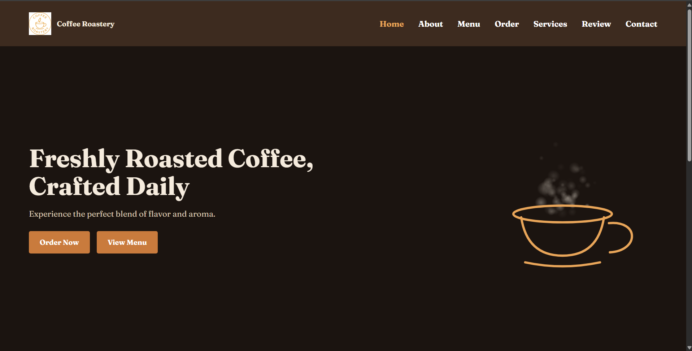 | 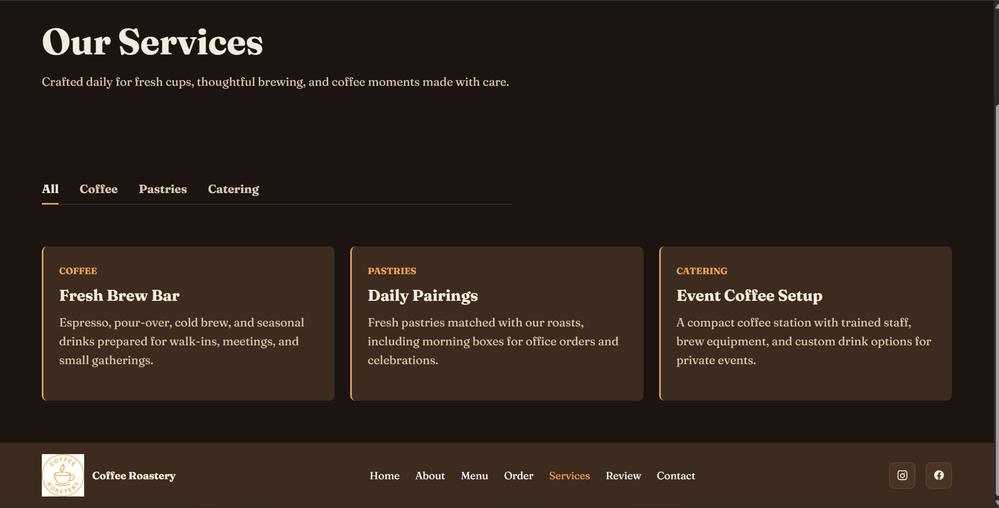 |

### 📅 Menu Pages
| Menu Overview | Category Filtering | Item Grid |
| --- | --- | --- |
| 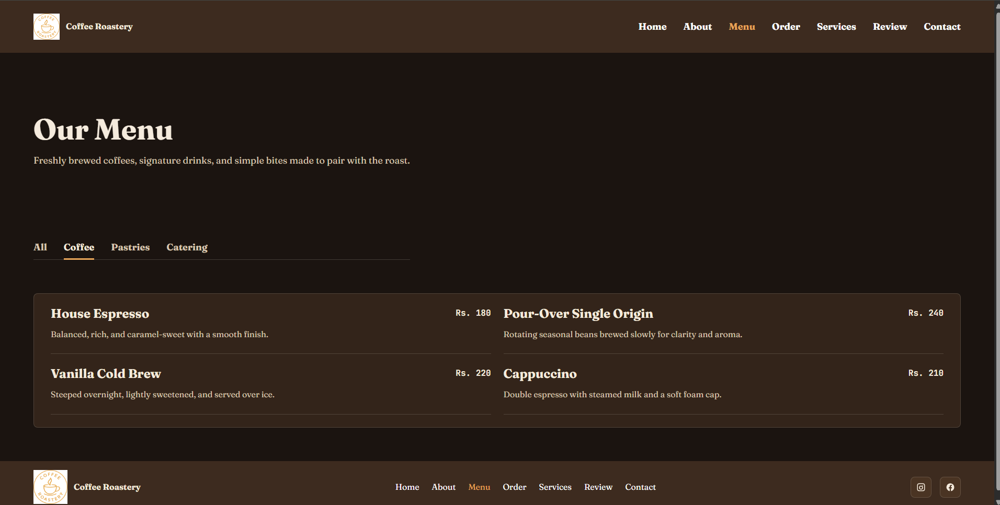 | 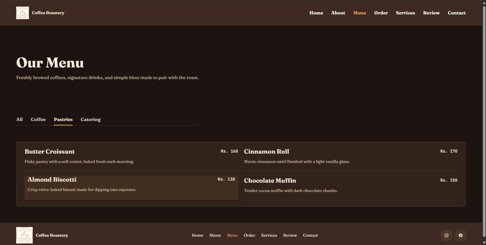 | 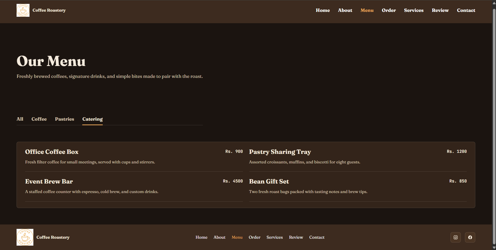 |

### 📖 About Page Sections
| Hero & Brand Story | Quality Standards | Meet the Team | Roast Marquee |
| --- | --- | --- | --- |
| 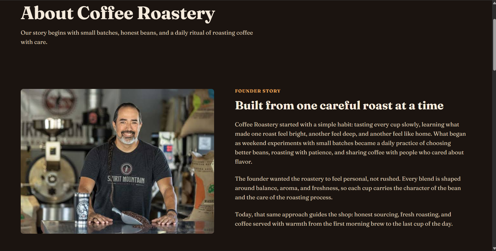 | 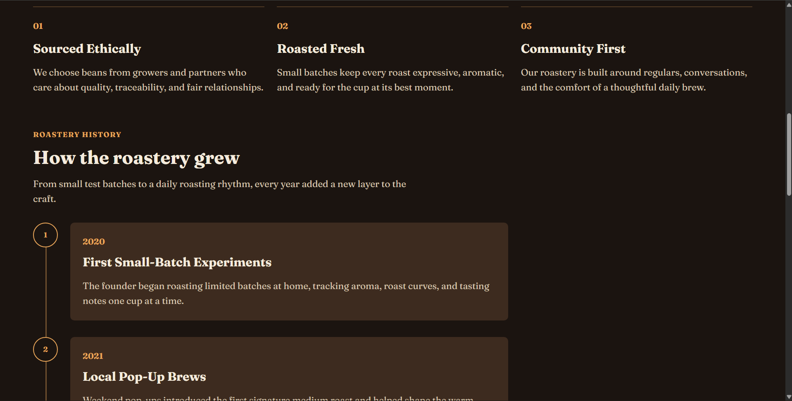 | 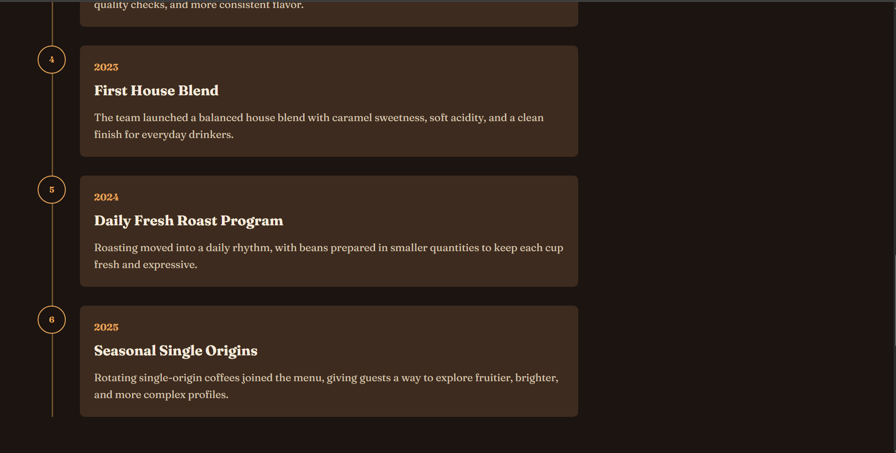 | 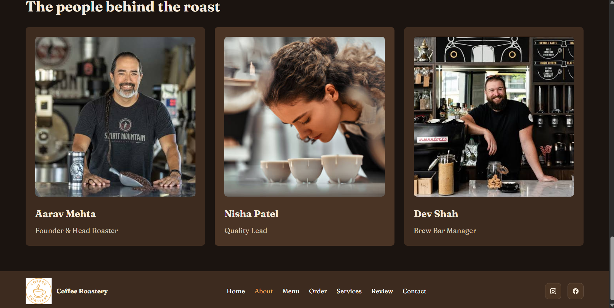 |

### 🛒 Ordering Flow
| Order Form / Menu Selection | Successful Order Placement |
| --- | --- |
| 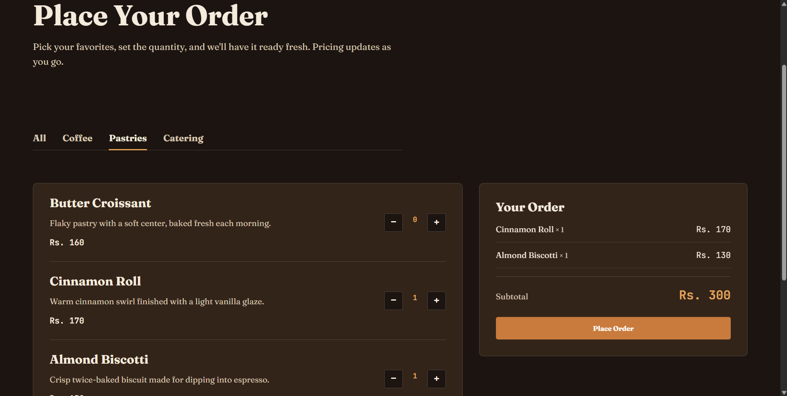 | 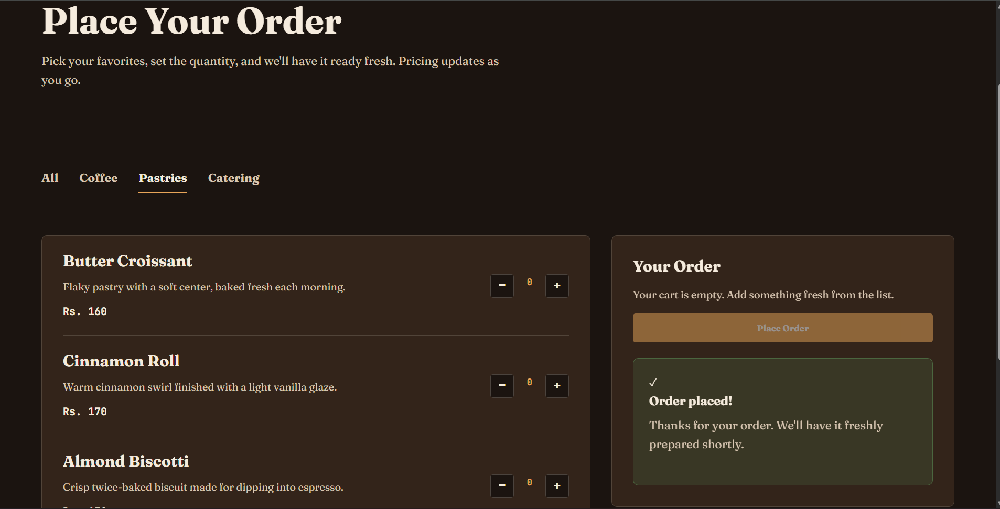 |

### 💬 Review & Contact Pages
| Reviews / Ratings Form | Contact Details | Contact Form Submission |
| --- | --- | --- |
| 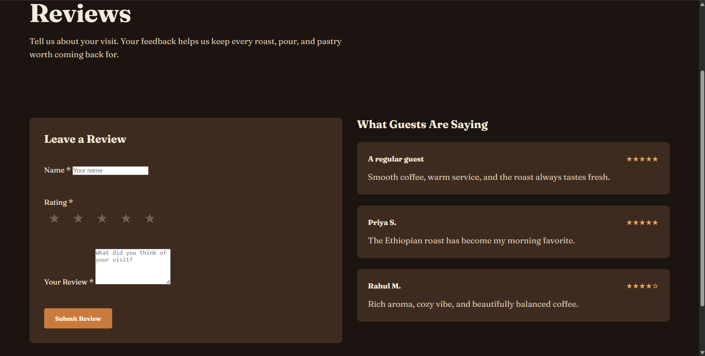 | 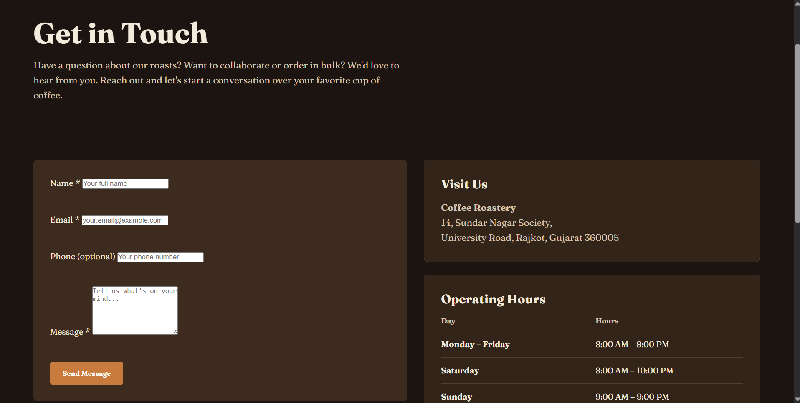 | 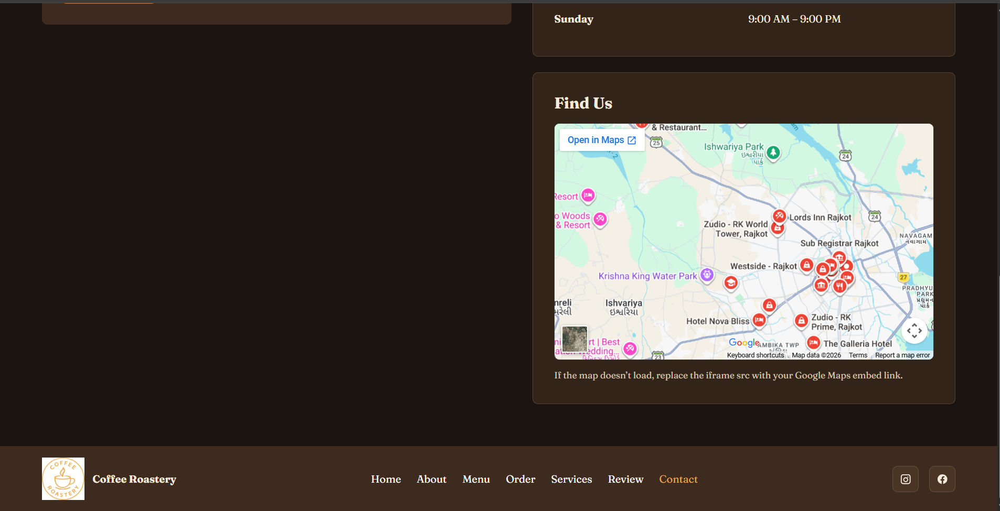 |

